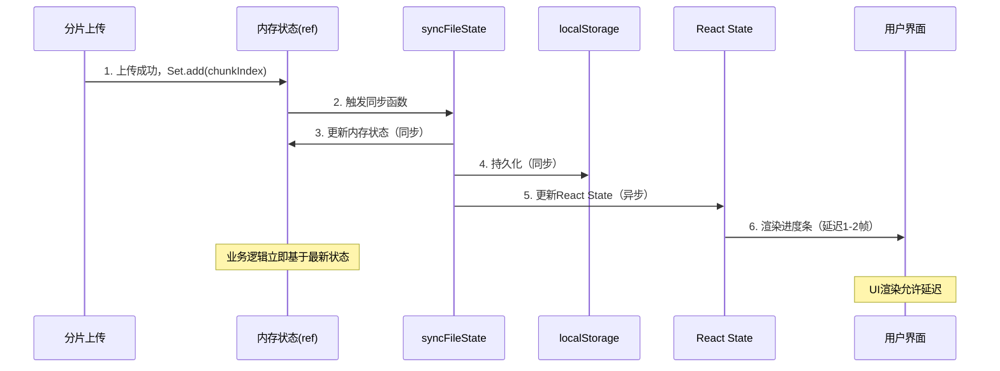

# 多文件断点续传上传组件 - 技术架构方案

## 一、架构设计概览

### 1.1 核心设计理念

本组件采用**状态分层架构**，将业务逻辑与UI渲染完全解耦，遵循业界主流上传库（Uppy、阿里云OSS SDK）的设计模式。

```
┌─────────────────────────────────────────────────────────┐
│                     用户交互层 (UI)                      │
│              React State (异步，仅渲染)                  │
└──────────────────────┬──────────────────────────────────┘
                       │ 事件触发
                       ↓
┌─────────────────────────────────────────────────────────┐
│                  业务逻辑层 (Hook)                       │
│           useRef 内存状态 (同步，决策中心)               │
└──────────────────────┬──────────────────────────────────┘
                       │ 状态同步
                       ↓
┌─────────────────────────────────────────────────────────┐
│                  持久化层 (Storage)                      │
│              LocalStorage (断点续传)                     │
└──────────────────────┬──────────────────────────────────┘
                       │ 数据交互
                       ↓
┌─────────────────────────────────────────────────────────┐
│                   服务端 (Backend)                       │
│          分片存储 + 校验 + 合并                          │
└─────────────────────────────────────────────────────────┘
```

### 1.2 核心优势

| 特性 | 传统方案 | 本方案 |
|------|---------|--------|
| 状态管理 | React State 统一管理 | 分层管理（业务用ref，UI用state） |
| 异步问题 | 闭包、延迟、不一致 | 同步原子操作，100%准确 |
| 数据结构 | Array（O(n)查找） | Set（O(1)查找，自动去重） |
| 暂停续传 | 维护暂停位置 | 无状态设计，自动断点续传 |
| 合并判断 | 可能不准确 | 基于内存状态，绝对准确 |

---

## 二、状态分层架构

### 2.1 三层状态设计

#### **第一层：内存状态（业务决策中心）**
```
fileStateRef (useRef)
├── Map<fileId, {
│     fileMd5: string           // 文件唯一标识
│     totalChunks: number       // 总分片数
│     uploadedChunks: Set<number>  // 已上传分片集合（核心）
│     status: UploadStatus      // 当前状态
│   }>
```

**职责**：
- ✅ 所有业务决策（暂停判断、合并触发、进度计算）
- ✅ 同步读写，无延迟
- ✅ Set 数据结构，自动去重、O(1)查找

**为什么不用 React State**：
- React setState 是异步调度，存在1-2帧延迟
- 在上传循环中读取 state 会捕获闭包中的旧值
- 业务逻辑需要实时准确的状态，不能容忍延迟

---

#### **第二层：React 状态（UI 渲染层）**
```
uploadList (useState)
├── Map<fileId, FileUploadItem>
    ├── file: File
    ├── status: UploadStatus
    ├── progress: number
    ├── uploadedChunks: number[]  // 转为数组供UI使用
    ├── totalChunks: number
    └── error: string
```

**职责**：
- ✅ 仅负责 UI 渲染（进度条、状态显示、按钮禁用等）
- ✅ 不参与任何业务决策
- ✅ 允许1-2帧延迟（用户无感知）

**更新机制**：
- 内存状态更新后，通过 `syncFileState()` 异步同步到 React State
- UI 延迟无影响，因为业务逻辑已在内存层完成

---

#### **第三层：持久化层（断点续传）**
```
localStorage
├── file_upload_{fileMd5}
    ├── uploadedChunks: number[]
    ├── totalChunks: number
    ├── fileName: string
    └── lastUpdateTime: number
```

**职责**：
- ✅ 断点续传：页面刷新后恢复上传
- ✅ 24小时自动过期
- ✅ 前端缓存优化，后端校验为准

**数据流**：
```
上传分片成功 → 更新内存状态 → 同步到 localStorage → 异步更新 UI
```

---

### 2.2 状态同步流程



---

## 三、核心业务流程

### 3.1 上传文件完整流程

```
1. 选择文件
   ↓
2. 生成 MD5（唯一标识）
   ↓
3. 校验已上传分片
   ├─ localStorage（前端缓存）
   └─ Backend API（权威数据源）
   ↓
4. 初始化内存状态
   ├─ uploadedChunks: Set<number>（从校验结果初始化）
   └─ status: "uploading"
   ↓
5. 过滤待上传分片
   chunks.filter(i => !uploadedChunks.has(i))
   ↓
6. 串行上传分片（for循环）
   ├─ 每个分片上传成功 → Set.add(index)
   ├─ 每次循环检查：status === "paused" ? break
   └─ 同步更新三层状态
   ↓
7. 判断是否合并
   if (uploadedChunks.size === totalChunks) {
     调用后端 merge API
   }
   ↓
8. 清理状态
   ├─ 清除 localStorage
   └─ 删除内存状态
```

---

### 3.2 暂停/继续机制（无状态设计）

#### **传统方案的问题**：
```javascript
// ❌ 需要维护暂停位置
pausedAt: number
resumeFrom: number

// 继续时从暂停位置开始
for (let i = resumeFrom; i < chunks.length; i++) {
  await uploadChunk(i)
}
```

#### **本方案设计**：
```javascript
// ✅ 无需维护位置，依靠断点续传
handlePause() {
  state.status = "paused"  // 仅标记状态
}

handleResume() {
  uploadFile(fileId)  // 直接复用上传逻辑
}

// uploadFile 内部自动过滤已上传分片
unUploadedChunks = chunks.filter(i => !uploadedChunks.has(i))
```

**优势**：
- ✅ 代码简洁，逻辑统一
- ✅ 暂停后刷新页面再继续，仍能正确恢复
- ✅ 无需维护额外状态

---

### 3.3 合并触发条件（兜底机制）

```
前端判断条件：
if (uploadedChunks.size === totalChunks) {
  POST /api/upload/merge
}

后端验证：
1. 检查所有分片文件是否存在
2. 验证每个分片的 MD5（可选）
3. 所有分片完整才执行合并

目的：
避免前端计数错误导致的文件不完整
```

---

## 四、数据结构设计

### 4.1 为什么用 Set 而非 Array

| 操作 | Array | Set |
|------|-------|-----|
| 查找元素 | O(n) - includes(i) | O(1) - has(i) |
| 添加元素 | O(n) - push + 去重 | O(1) - add(i) 自动去重 |
| 获取数量 | O(1) - length | O(1) - size |
| 内存占用 | 小 | 略大 |

**业务场景分析**：
- 分片上传：频繁查找（是否已上传）→ Set 优势明显
- 43个分片：Array 需43次比较，Set 仅1次哈希查找
- 自动去重：避免重复上传同一分片

---

### 4.2 内存状态 vs React 状态

```typescript
// 内存状态（业务逻辑）
fileStateRef.current = Map<string, {
  uploadedChunks: Set<number>  // ✅ Set，业务逻辑用
}>

// React 状态（UI 渲染）
uploadList = Map<string, {
  uploadedChunks: number[]     // ✅ Array，UI 遍历用
}>

// 同步时转换
syncFileState() {
  reactState.uploadedChunks = Array.from(refState.uploadedChunks)
}
```

---

## 五、关键技术决策

### 5.1 校验权威：后端为准

```
前端缓存策略：
1. 优先读取 localStorage（性能优化）
2. 若无缓存，请求后端校验接口
3. 以后端返回为准，前端缓存可能过期/被清除

后端职责：
1. 记录所有已上传分片
2. 提供校验接口返回已上传列表
3. 合并前强制验证所有分片
```

**防御性设计**：
```
前端计数错误 + 后端验证 → 合并失败（安全）
前端计数正确 + 后端验证 → 合并成功（正常）
```

---

### 5.2 串行 vs 并行上传

| 方案 | 优势 | 劣势 | 适用场景 |
|------|------|------|---------|
| 串行（当前） | 逻辑简单、暂停精准、服务器压力小 | 速度慢 | 稳定性优先、网络不稳定 |
| 并行 | 速度快 | 逻辑复杂、暂停困难、服务器压力大 | 性能优先、网络稳定 |

**扩展方案**：
```javascript
// 可配置并发数
const CONCURRENCY = 3

async function uploadParallel(chunks) {
  const tasks = chunks.map(chunk => uploadChunk(chunk))
  await Promise.allSettled(tasks)  // 等待所有完成
  
  // 统一判断 merge（避免异步问题）
  if (uploadedChunks.size === totalChunks) {
    merge()
  }
}
```

---

### 5.3 错误处理策略

```
分片上传失败：
├─ 网络错误 → 抛出异常，标记失败，用户手动重试
├─ 暂停取消 → 静默处理，不算失败
└─ 服务器错误 → 抛出异常，显示错误信息

文件级别失败：
├─ 清理内存状态
├─ 不清理 localStorage（断点续传用）
└─ UI 显示失败状态，允许重试

重试策略：
用户手动重试 → 复用 uploadFile → 自动断点续传
```

---

## 六、性能优化

### 6.1 MD5 计算优化

```
当前方案：
FileReader.readAsArrayBuffer() → SparkMD5

优化方向：
1. Web Worker 异步计算（避免阻塞主线程）
2. 增量计算：大文件分批读取
3. 缓存 MD5：相同文件无需重复计算
```

---

### 6.2 UI 更新优化

```
问题：每个分片上传完触发一次 setState

优化：
1. 节流更新：100ms 内多次更新合并为一次
2. 虚拟列表：文件数 > 50 时启用
3. 批量更新：多个文件同时上传时合并状态更新
```

---

## 七、扩展性设计

### 7.1 支持的扩展功能

| 功能 | 实现难度 | 改动点 |
|------|---------|--------|
| 并发上传控制 | 低 | 修改上传循环为 Promise.all(限流) |
| 上传速度限制 | 中 | axios 请求添加延迟控制 |
| 秒传功能 | 低 | 上传前先校验 MD5 是否已存在 |
| 文件加密 | 中 | 分片前加密 Blob |
| 断点下载 | 高 | 需要服务端支持 Range 请求 |

---

### 7.2 插件化架构（未来）

```typescript
// 钩子函数设计
interface UploadHooks {
  beforeUpload?: (file: File) => boolean
  onChunkSuccess?: (chunkIndex: number) => void
  onProgress?: (percent: number) => void
  onComplete?: (fileId: string) => void
  onError?: (error: Error) => void
}

// 使用
useUploadFile({
  hooks: {
    onChunkSuccess: (index) => {
      console.log(`分片 ${index} 上传成功`)
    }
  }
})
```

---

## 八、团队协作指南

### 8.1 前端开发者

**需要了解**：
- 状态分层概念：ref 管业务，state 管 UI
- Set 数据结构使用
- syncFileState 统一入口

**无需关心**：
- 后端如何存储分片
- localStorage 具体格式
- 分片上传的网络细节

---

### 8.2 后端开发者

**需要提供**：
1. `POST /api/upload/chunk` - 接收单个分片
2. `POST /api/upload/verify` - 校验已上传分片列表
3. `POST /api/upload/merge` - 合并所有分片

**需要保证**：
- verify 接口返回准确的已上传列表
- merge 前强制验证所有分片存在
- 分片存储按 MD5 + index 命名

---

### 8.3 测试要点

| 场景 | 预期结果 |
|------|---------|
| 上传中暂停 | 立即停止，进度保留 |
| 暂停后继续 | 从断点恢复，不重复上传 |
| 刷新页面后继续 | 从 localStorage 恢复进度 |
| 网络断开重试 | 自动跳过已上传分片 |
| 43个分片全部上传完 | 自动触发合并 |
| 同时上传多个文件 | 互不干扰 |

---

## 九、总结

### 9.1 核心价值

1. **生产级稳定性**：状态分层 + Set 原子操作，100%准确
2. **业界最佳实践**：参考 Uppy/阿里云 OSS SDK 架构
3. **易维护扩展**：清晰分层，职责明确
4. **用户体验优秀**：暂停/续传/断点续传无缝支持

### 9.2 技术亮点

- ✅ **状态分层架构**：业务逻辑与 UI 渲染完全解耦
- ✅ **同步原子操作**：基于 useRef + Set，避免所有异步问题
- ✅ **无状态暂停续传**：复用上传逻辑，无需维护暂停位置
- ✅ **权威校验机制**：后端为准，前端缓存仅做优化
- ✅ **兜底合并验证**：前端计数错误也不会导致文件损坏

### 9.3 适用场景

✅ 大文件上传（视频、压缩包等）  
✅ 网络不稳定环境  
✅ 需要断点续传的场景  
✅ 多文件批量上传  
✅ 企业级生产系统

---

**文档版本**: v1.0  
**最后更新**: 2026-01-16  
**维护者**: 开发团队
